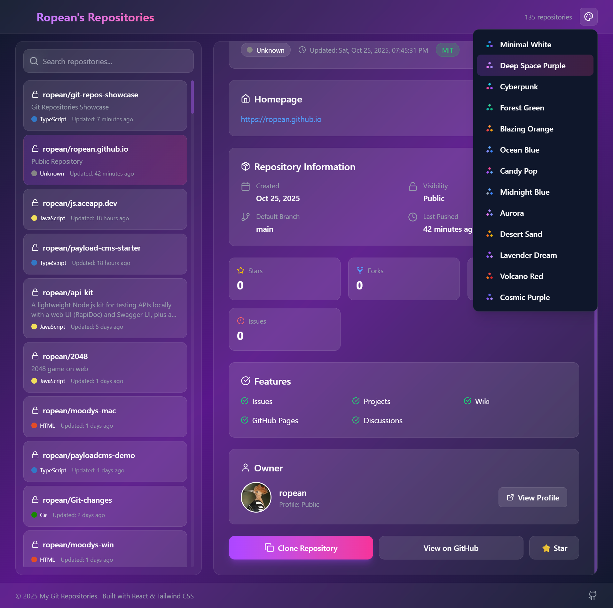
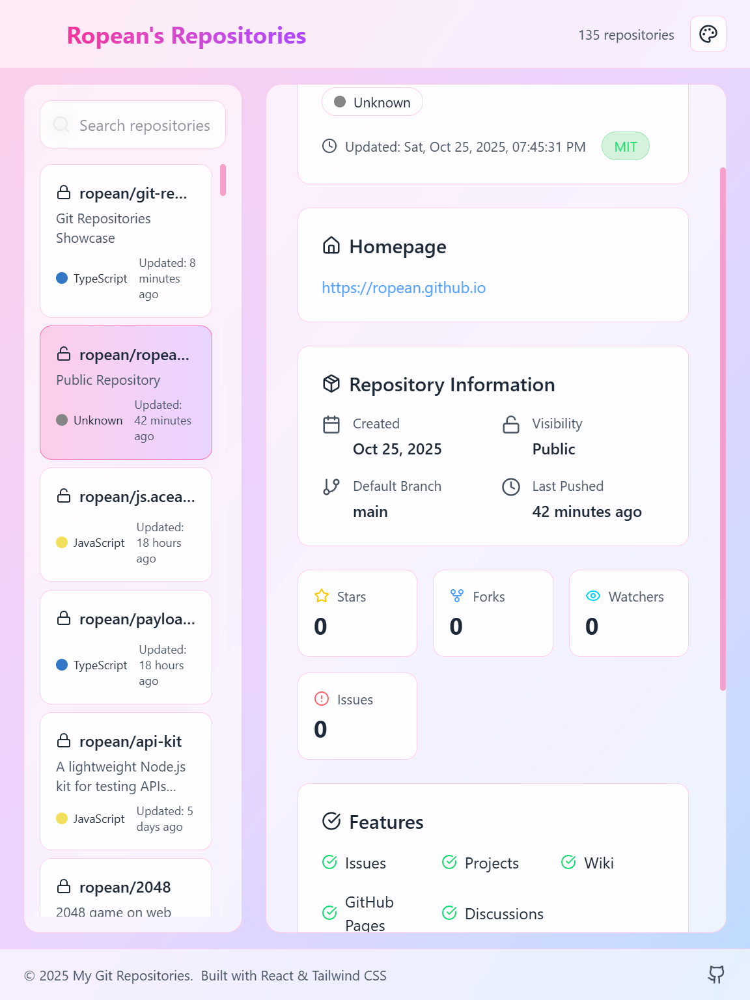
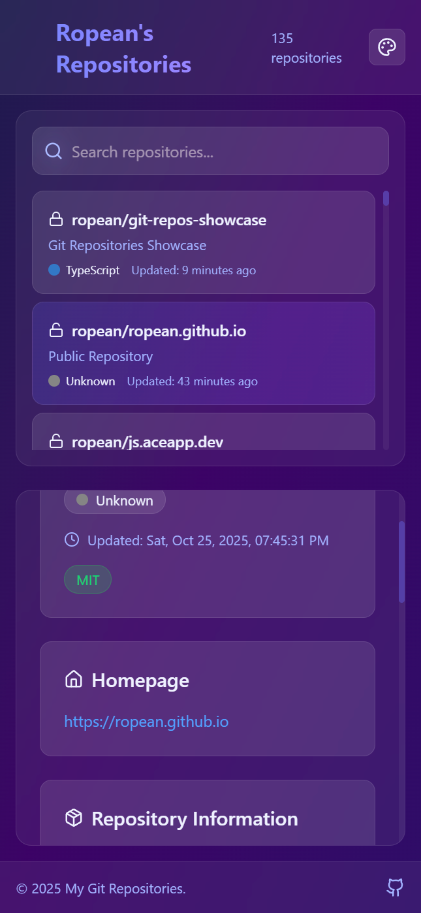
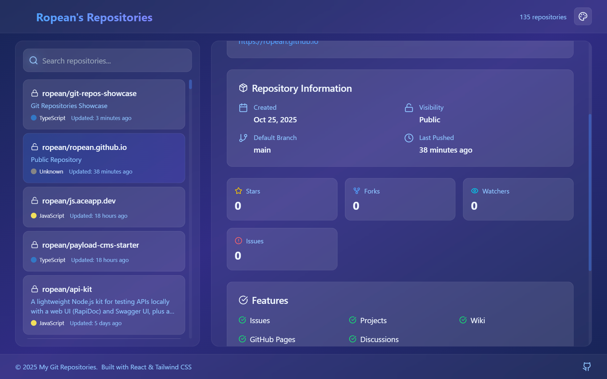

# Ropean's Repositories

[](https://github.com/ropean/ropean.github.io/actions/workflows/deploy.yml)
[](https://ropean.github.io)

A responsive portfolio website showcasing all my GitHub repositories with detailed information and statistics.

## 🚀 Live Site

Visit the live site at [ropean.github.io](https://ropean.github.io)

## ✨ Features

- 📱 Fully responsive design - works seamlessly across all devices
- 🎨 Modern UI built with React and Tailwind CSS
- 📊 Real-time GitHub repository data
- 🔍 Easy navigation and repository discovery
- ⚡ Fast and optimized performance

## 📸 Screenshots

### Desktop View



### Tablet View



### Mobile View



### Large Display View



## 🛠️ Built With

- **React** - JavaScript library for building user interfaces
- **Tailwind CSS** - Utility-first CSS framework for responsive styling
- **GitHub Pages** - Hosting platform
- **GitHub Actions** - Automated deployment workflow
- **GitHub API** - Fetching repository data

## 📁 Project Structure

```text
ropean.github.io/
├── .github/
│   └── workflows/     # GitHub Actions deployment workflows
├── dist/              # Built React application (GitHub Pages source)
├── screenshoots/      # Website screenshots
└── README.md
```

## 🚢 Deployment

This site is automatically deployed to GitHub Pages using GitHub Actions. The workflow builds the React application and deploys it to the `dist` directory whenever changes are pushed to the main branch.

### Deployment Workflow

1. Code is pushed to the repository
2. GitHub Actions workflow is triggered
3. React app is built with production optimizations
4. Built files are placed in the `dist` directory
5. GitHub Pages serves the site from `dist`

## 📄 License

This project is open source and available under the [MIT License](LICENSE).

## 📧 Contact

Feel free to reach out through GitHub or visit my [portfolio](https://ropean.github.io) for more information.

---

Built with ❤️ by Ropean(<https://ropean.org>)
